Assembly
========

If you’ve purchased the kit, the “Components” section lists all the items you should have in your kit and “Tools” lists the tools you’ll need. The “Electronics” and “Hardware” sections describe how to solder everything together and how to mount everything in the standard 3D‑printable enclosure, available from www.thingiverse.com/thing:6188155.

Once you’ve assembled your SquishBox and installed the software, you should be ready to plug in and play! If you need any further assistance visit geekfunklabs.com/support. We hope you enjoy making music with the SquishBox!

Components
----------

The components needed to build the electronics for the SquishBox are listed below, and referenced in the image. You will also need a Raspberry Pi computer with an SD card to install software, and a power supply. The SquishBox and your Pi can be powered with a 5 Volt/2 Amp power supply via the 5.5mm × 2.1mm DC barrel jack, or you can use your existing Pi power supply plugged directly into your Pi's power port.

A. PCB with surface-mounted components
B. LED blue 5mm
C. 10K potentiometer
D. 16x2 character LCD
E. 2x20 female header
F. 1x12 male header
G. 1x4 right-angle male header
H. momentary stompswitch
I. rotary pushbutton encoder
J. decorative knob
K. 1/4" TRS audio jacks (2)
L. 5.5x2.1mm DC barrel jack
M. 26 AWG ribbon cable

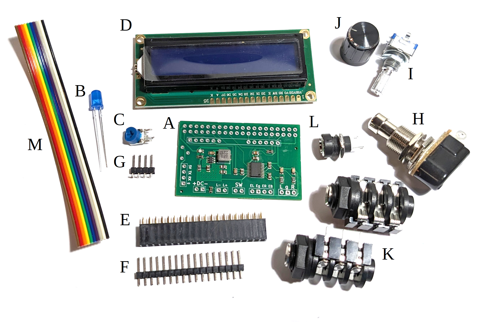

   Components included in the deluxe SquishBox kit.

Tools
-----

The following tools will be useful in assembling the SquishBox:

* Soldering Iron, Solder
* Flush Cutters
* Wire Strippers capable of stripping 26 AWG
* Needlenose pliers (optional but very helpful)
* Small screwdrivers, cross- and flat-head
* A way to hold items steady while you solder
    * vise
    * helping hands tool
    * (my favorite) a wad of poster tack/putty

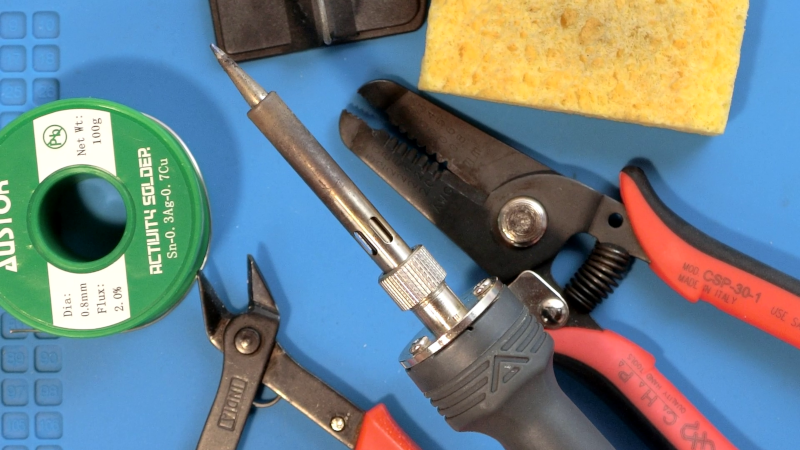

Electronics
-----------

In the instructions below, the “top” side of the PCB is considered to be the side with the surface-mounted components. Make sure to do the steps in order and solder the LCD and 2x20 header on last, otherwise you won’t be able to reach some of the components.

1. The button, encoder, and jacks are connected to the PCB using strips of multicolored ribbon cable, which helps to keep things organized and makes the connections easier to track. Slice off a strip of 4 wires, a strip of 3 wires, and a strip of 2 wires. Cut the strip of 2 wires halfway along its length. Separate the wires at the ends of each strip as shown, and strip, twist, and tin (add a thin coat of solder to) the ends. This makes them stronger and easier to solder in place.

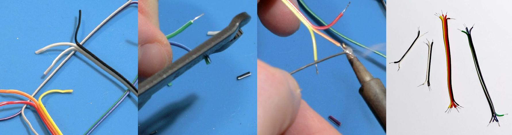

2. Insert your ribbon cable strips into the holes along the edge of the board as listed below. Bend the ends of the wires flat to hold them in place, then solder them and trim any excess away.

    * A strip of two wires for the DC input (``+DC-``)
    * A strip of two wires for the momentary button (``SW``)
    * A strip of four wires for the rotary encoder (``EL Eg ER EB``)
    * A strip of three wires for the audio output (``L g R``)

.. image:: images/solder_wires.png

3. Insert the short ends of the right-angle header into the holes for the serial port (``5V TX RX g``) into the bottom side of the PCB as well and hold it in place with some putty. Solder one pin first and check that the long pins stick out parallel to the PCB before soldering the rest. Push the three legs of the 10K potentiometer through the PCB from the bottom side. The kinks in the legs require a bit of extra force, but once it pops through they will hold the component in place while you solder.

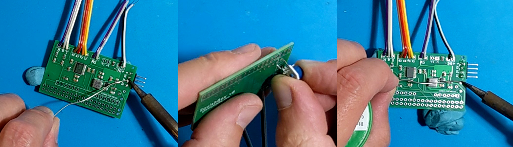

4. Insert just the ends of the LED into the holes marked ``L- L+``. The longer leg is positive. Bend the legs so the LED is parallel to the plane of the PCB and solder the legs in place.

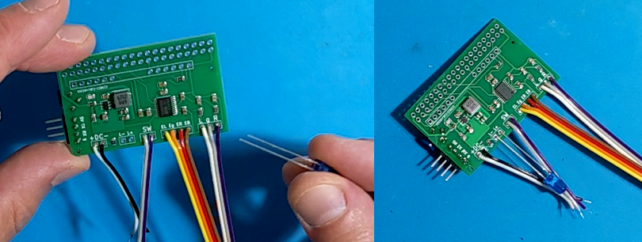

5. Break off two six-pin lengths of male header and solder them to the outside pins of the LCD as shown. The middle four pins D0-D3 are not used. Start with one pin on each header, and make sure they are fully seated and the pins all stick up parallel to each other and perpendicular to the board before soldering the rest of the pins.

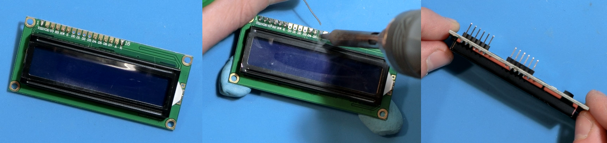

6. Insert the LCD into the top side of the PCB, but only push the pins through just enough so you can solder them to the bottom side of the PCB as shown. This allows the LCD to fit over a Raspberry Pi’s USB ports and Ethernet jack. Solder one pin on each end first and check the fit, then do the rest after re-melting and adjusting if necessary.

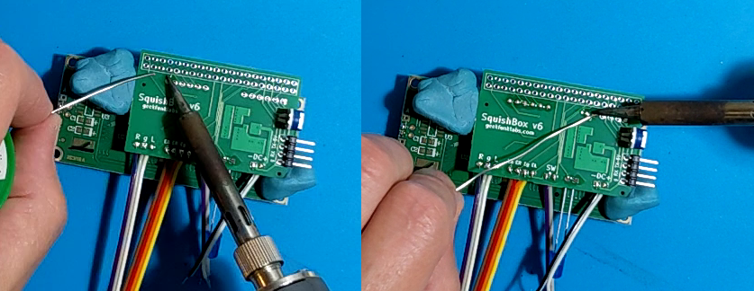

7. Insert the 2×20 female header into the underside of the PCB. As with the other headers, solder two pins at either end, then check that the socket is flush against the board so you can re-melt and adjust if necessary before proceeding to solder all 40 pins in place.

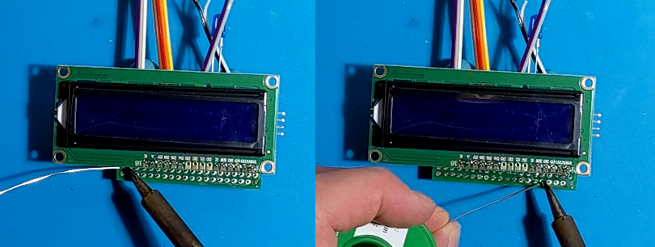

You have now soldered all the components that go into the PCB. You’ll solder all those floating wires to the button, encoder, and jacks after installing them in an enclosure. This makes it easier to keep them in one spot while you solder, and less likely you’ll rip wires when screwing things into the enclosure.

Hardware
--------

The steps in this section describe how to mount all the components in your enclosure and solder wires to the jacks, button, and encoder. You can 3D-print the official PLA case shown below by downloading the model files from https://www.thingiverse.com/thing:6188155. The lid screws on with four #4 size screws.

Similar to the last section, components can get in the way of your soldering if you install them in the wrong order, so you’ll have the easiest time if you do the steps as shown.

1. The enclosure has two clips that will hold the all the electronics in place. Viewing from bottom side of the PCB with the 2x20 header at the top, insert the right edge of the LCD in the opening and slide it underneath the right-hand clip. Bend the LED’s legs so it pokes through the hole in the enclosure. Now press down on the left side of the LCD with your thumb until it pops into place. It may help to use a screwdriver as a lever to flex the case a bit to get the LCD past the clip. If you mangle the clips doing this or just want some extra hold you can squirt some hot glue through the holes onto the mounting posts.

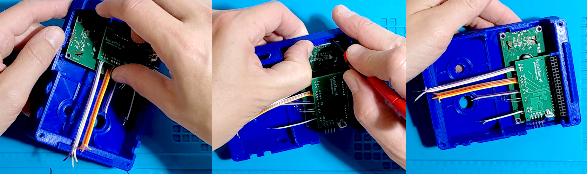

2. Bend the pins of the rotary encoder outwards and apply some solder to them. This makes it easier to solder the floating wires to them. Insert the encoder in the enclosure and secure it with the nut and washer. to them. Two of the pins need ground – solder a short wire between them as shown in the diagram. Connect the wires from the PCB to the encoder as shown in the diagram.

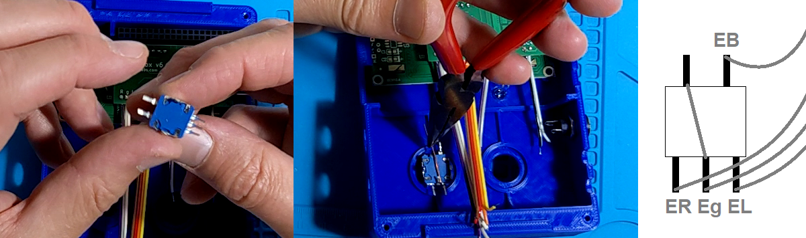

3. Next, install the DC jack. The nut for this component screws on from the inside of the enclosure, so you have to do it before you solder the wires on. The shorter lug connects to the center pin on your power supply, so if you are using a standard center-negative 9V effects pedal adapter you want to solder ``DC-`` to the short lug and ``DC+`` to the longer lug.

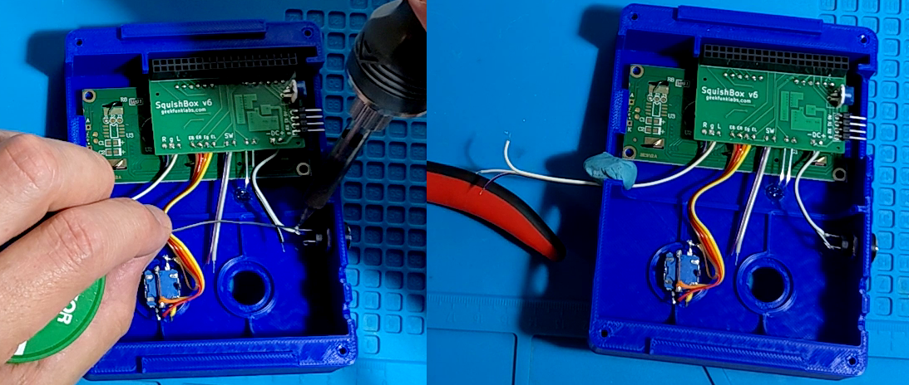

4. Screw the stompbutton into the enclosure, and solder the ``SW`` wires from the PCB to the stompbutton’s lugs – they can go either way. It can be helpful to bend the wire ends into hooks to get them to stay in the lugs while you solder.

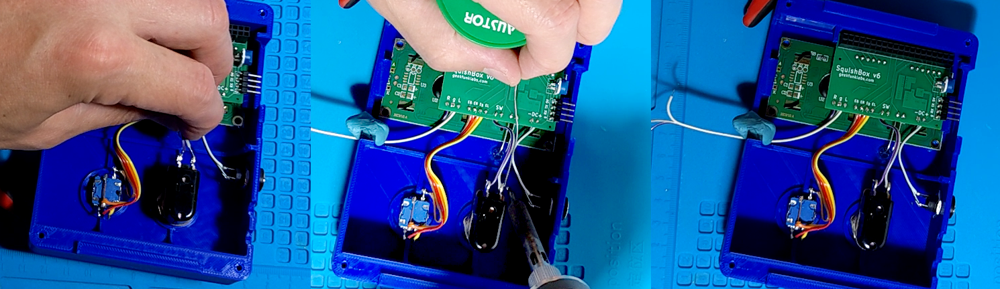

5. Now wire up the audio jacks. Each jack has six pins, shown in the diagram below as they are laid out in the picture, which connect to the tip, ring, and sleeve of an audio jack. The "N" pins are normally connected, but when a plug is inserted the connections are broken, allowing audio to be routed depending on which jacks have plugs inserted. Apply some solder to the pins first. Use bits of wire or resistor legs to connect left ``NT`` to right ``T``, left ``R`` to right ``NT``, and left ``S`` to right ``S`` (as shown by the red lines in the diagram). Then connect the ``R``, ``g``, and ``L`` wires from the audio outputs on the PCB to the right jack’s ``S`` and ``T`` and the left jack’s ``T``, respectively (shown by the blue lines in the diagram).

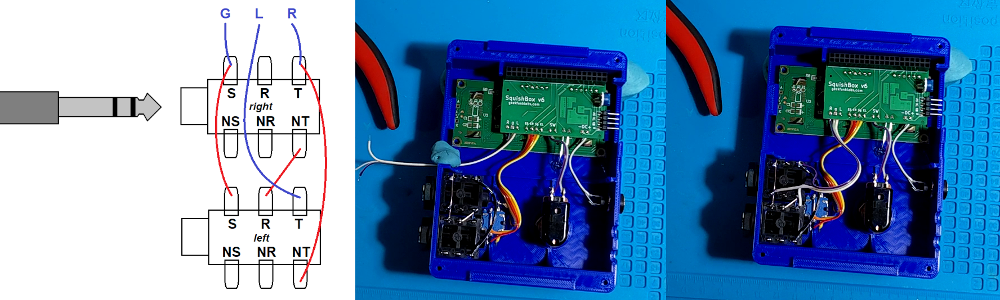

At this point you have finished assembling your SquishBox. You will install the Raspberry Pi and set up software in the next sections.
