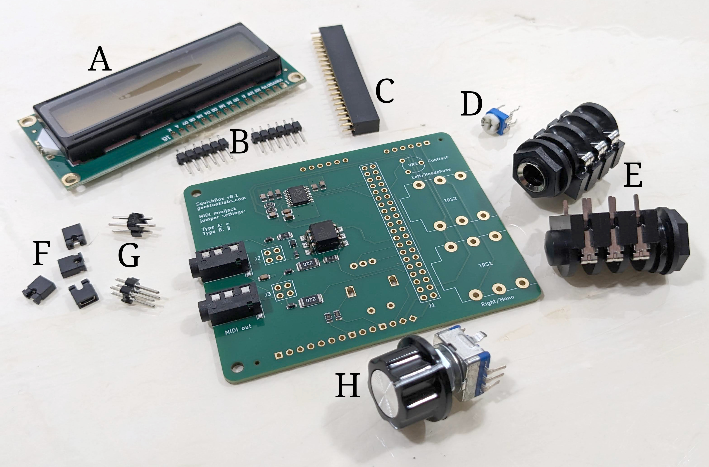
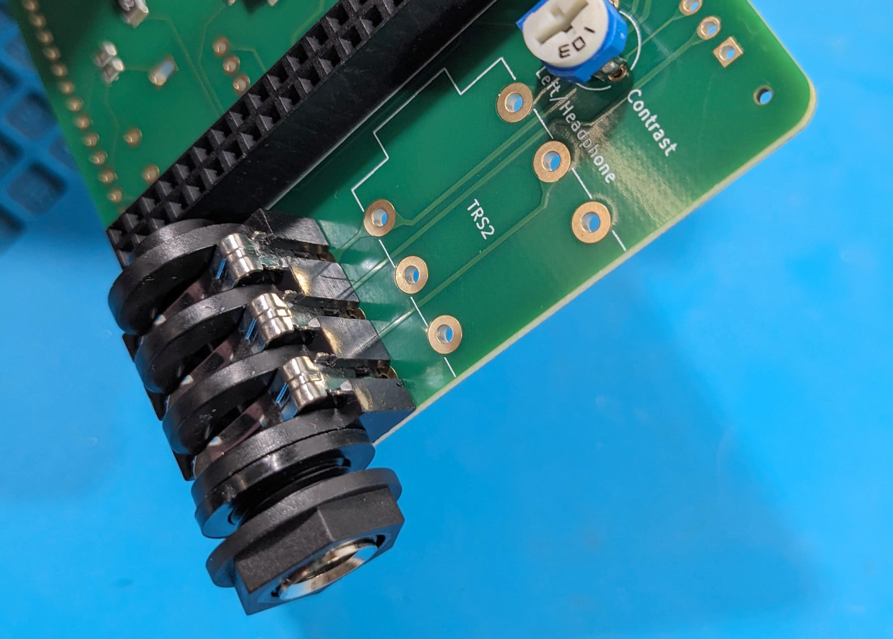
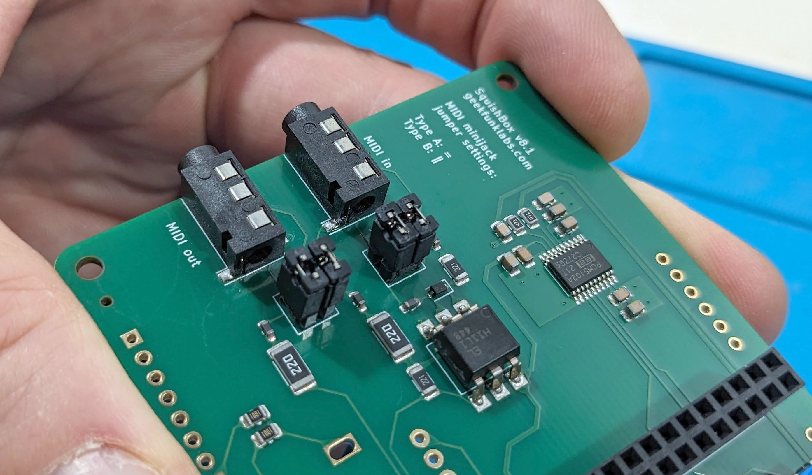
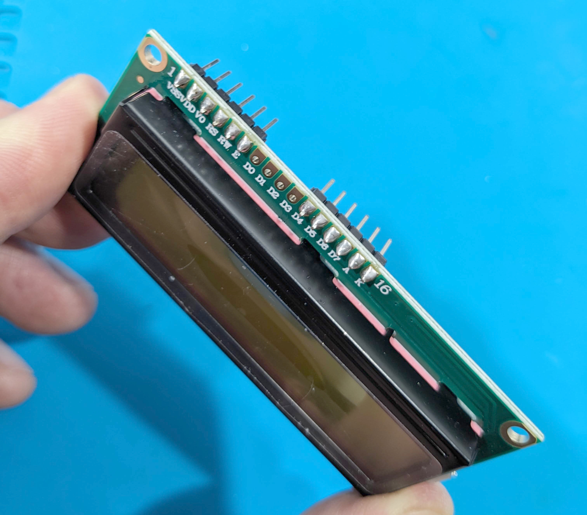
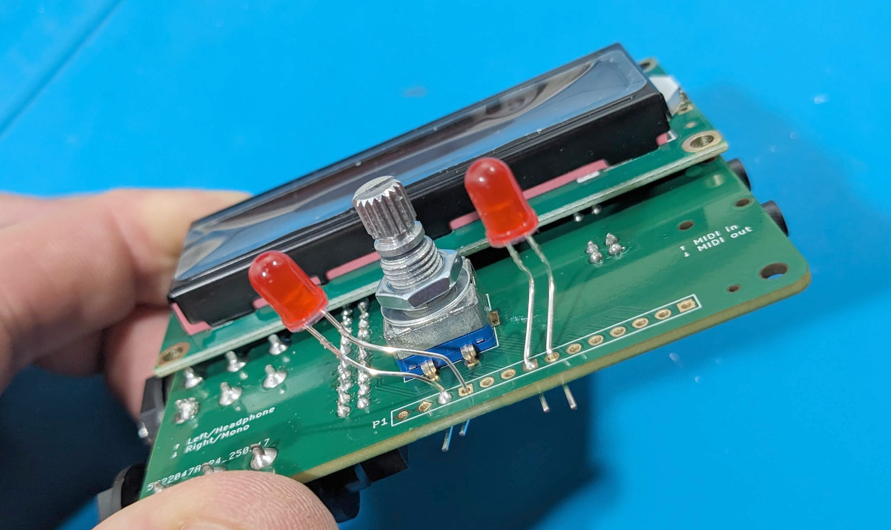
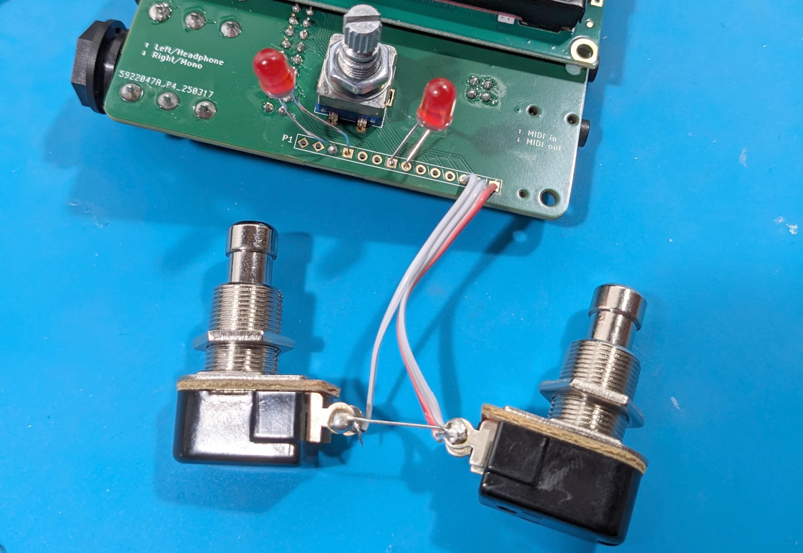
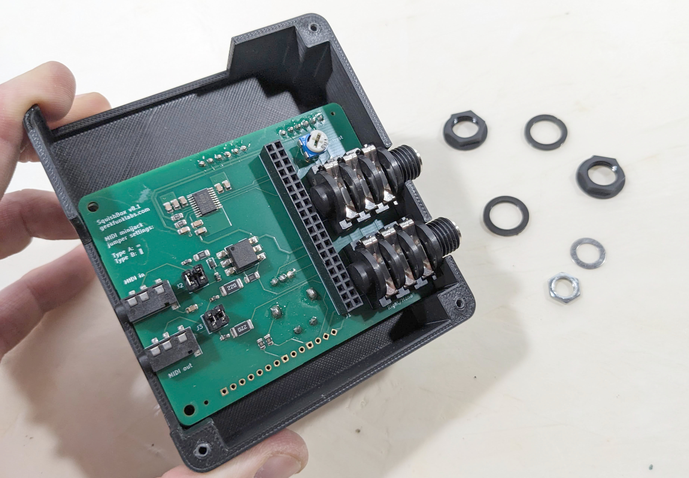
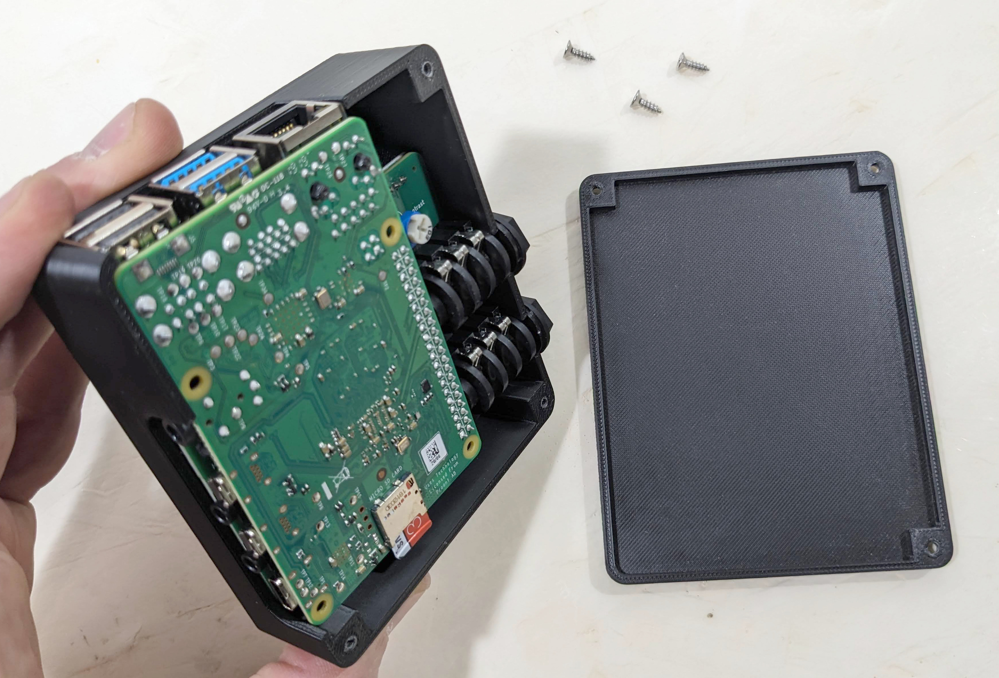

Assembly
========

This section explains how to assemble a SquishBox from a kit, or from
individually sourced parts after obtaining a fabricated PCB, printing an
enclosure, and gathering the required through-hole components.

Components
----------

In addition to the PCB (with surface-mount components pre-installed) and the
3D-printed PLA enclosure, a standard SquishBox kit includes:

    A. 16x2 character LCD
    B. 1x6 male header strips (2)
    C. 2x20 female header
    D. 10K trimmer potentiometer
    E. 1/4" TRS audio jacks (2)
    F. 2x2 male headers (2)
    G. Jumper blocks (2)
    H. Rotary pushbutton encoder + knob

Optional / Deluxe model:

    J. Momentary footswitches (2)
    K. 5mm LEDs (2)

   Through-hole components for the SquishBox

Electronics Assembly
--------------------

General soldering tips:

* Install components on the side of the PCB with the matching silkscreen outline.
* Seat components flush against the PCB, especially the rotary encoder,
  audio jacks, and 2x20 header, so everything aligns properly with the enclosure.
* Install the LCD last, as it covers several other solder points.

PCB Orientation
^^^^^^^^^^^^^^^

The surface-mount components are on the PCB "bottom" side, which faces the
Raspberry Pi when installed.

Install these parts on the bottom side:

* Audio jacks
* 2x2 headers
* 2x20 female header
* Trimmer potentiometer

Install these parts on the top side:

* Rotary encoder
* LCD module (last)

   Proper component mounting

MIDI Jumper Configuration
^^^^^^^^^^^^^^^^^^^^^^^^^

Headers J2 and J3 configure the MIDI TRS jacks for Type A or Type B wiring
using jumper blocks.

As marked on the silkscreen:

* Type A: Horizontal connection ( = )
* Type B: Vertical connection ( ‖ )

   
   MIDI minijack jumpers in type A configuration

LCD Header
^^^^^^^^^^

The center four LCD pads (D0-D3) are unused.

Solder the 1x6 male header strips to the outer pads at each end of the LCD
connector.

   
   Correct installation of pins to LCD connector

Deluxe Components
^^^^^^^^^^^^^^^^^

The Deluxe model adds two LEDs and two momentary footswitches.

LED Installation:

Insert the short leg (cathode / ground) of each LED into the square notched
pads on header P1, positions 4 and 7. Insert the long leg into neighboring
pads 3 and 8.

Pads 4 and 7 include 1K current-limiting resistors.

Leave enough lead length above the PCB so the LEDs can reach the enclosure
openings before soldering.

   
   Proper LED mounting

Footswitch Wiring:

Strip and tin four short wires (about 3 cm each).

Wire the switches as follows:

* Connect one lug of each switch to P1 pads 12 and 13 (GPIO9 and GPIO10)
* Connect P1 pad 14 (GND) to the remaining lug of one switch
* Bridge that grounded lug to the remaining lug of the second switch

   
   Footswitch wiring

Final Assembly
--------------

Align the rotary encoder shaft, LEDs (if installed), and audio jacks with the
corresponding enclosure openings.

Press the PCB into place and secure it using the washers and nuts supplied
with the rotary encoder and audio jacks. Mount stompswitches if used.

   
   PCB mounted in enclosure

Install the Raspberry Pi by plugging its GPIO header into the 2x20 socket.

Secure the lid using the three included screws.

   
   Raspberry Pi Installation
