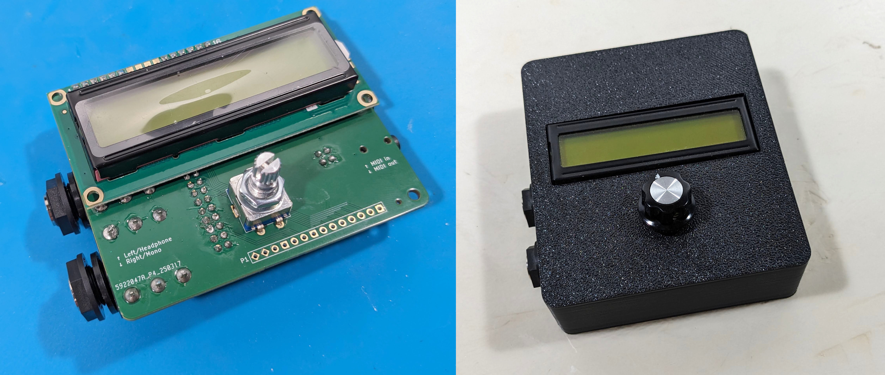

SquishBox Documentation
=======================

The SquishBox is an add-on board for the Raspberry Pi 3B+/4 that bundles
a DAC, 1/4" ouputs, MIDI in/out with minijacks, a 16x2 LCD, and a
pushbutton rotary encoder.
It is designed to be an embedded computer for audio applications,
such as a synth module or audio player.
It has a python API for easy access to buttons, LCD, and system functions.
Several pre-built apps are included.

* `Official Documentation <https://geekfunklabs.github.io/squishbox>`__
* `Source Repository <https://github.com/GeekFunkLabs/squishbox>`__

The SquishBox can be fabricated from scratch using the included design
files, or obtained as a kit or fully assembled device from the
Geek Funk Labs `store <https://geekfunklabs.com/store>`__.
Software is installed in an existing Raspberry Pi OS using a
command-line installer script.

   Assembled SquishBox electronics (left) and enclosure (right)

.. toctree::
   :maxdepth: 2
   :caption: Contents:

   quickstart
   userguide
   assembly
   software
   reference

