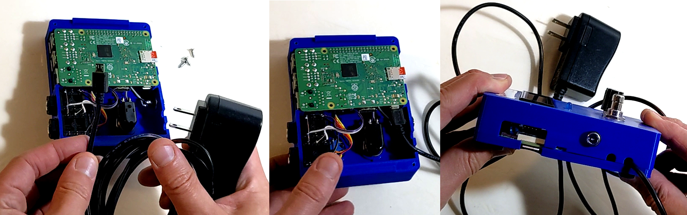

Installation
============

To install your Raspberry Pi into the SquishBox, just line up the pins on the Pi’s GPIO header with the SquishBox’s 2x20 female header and plug it in. Next, line up the posts on the lid with the mounting holes on the Pi and press it onto the SquishBox cover. The slots in the lid will snap on to the tabs in the cover. The lid will stay in place fairly well on its own, but a set of four #4 screws will make it tight and secure. Adhesive rubber bumpers on the base will keep the SquishBox in place when you’re using it.

.. image:: images/install_pi.png

You may need to adjust the LCD contrast to read the display clearly. Use a small screwdriver to adjust the 10k potentiometer until you get the desired contrast.

.. image:: images/adjust_contrast.png

You may already have a 5V Raspberry Pi power supply and wish to use that to power the SquishBox rather than obtaining a new adapter. You can plug your 5V adapter into the Pi and thread its cable through one of the notches in the cover, as shown below. You can use these notches to connect other cables to the Pi as well, such as USB hubs or HDMI cables.

