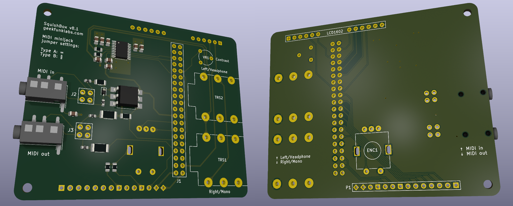

Reference
=========

PCB
---

This section collects hardware documentation, fabrication references,
and connector pinouts for users modifying or servicing the SquishBox.

Download manufacturing files from
https://github.com/GeekFunkLabs/squishbox/tree/main/hardware/pcb/fabrication.

   3D Render of SquishBox PCB with surface-mount components

Bill of Materials
^^^^^^^^^^^^^^^^^

The Interactive BOM allows part identification, placement lookup,
and assembly cross-referencing.

`Open Interactive BOM <_static/squishbox8_ibom.html>`__

Schematic
^^^^^^^^^

The full schematic is available below. Through-hole components are
crossed out to indicate they are sourced separately.

.. only:: html

    .. image:: images/squishbox8_schem.svg

    PDF version:
    :download:`Download <images/squishbox8_schem.pdf>`

.. only:: latex

    .. image:: images/squishbox8_schem.pdf

P1 Header
^^^^^^^^^

Unused Raspberry Pi GPIO pins are broken out to header **P1**
for switches, LEDs, sensors, and other add-ons.

Pins **4** and **7** include built-in 1k pull-down resistors to ground,
allowing LEDs to be connected directly.

======  =========  ==================
P1 Pin  Pad Shape  Function
======  =========  ==================
1       diamond    5V
2       diamond    3.3V
3       circle     GPIO4
4       notched    GPIO17 via 1k to GND
5       circle     GPIO2 (I2C SDA)
6       circle     GPIO3 (I2C SCL)
7       notched    GPIO27 via 1k to GND
8       circle     GPIO23
9       circle     GPIO24
10      circle     GPIO10
11      circle     GPIO25
12      circle     GPIO9
13      circle     GPIO11
14      square     GND
======  =========  ==================

API
---

The classes and functions below form the programming interface
for the squishbox package.

.. toctree::
   :maxdepth: 2

   api/squishbox
   api/hardware
   api/config

