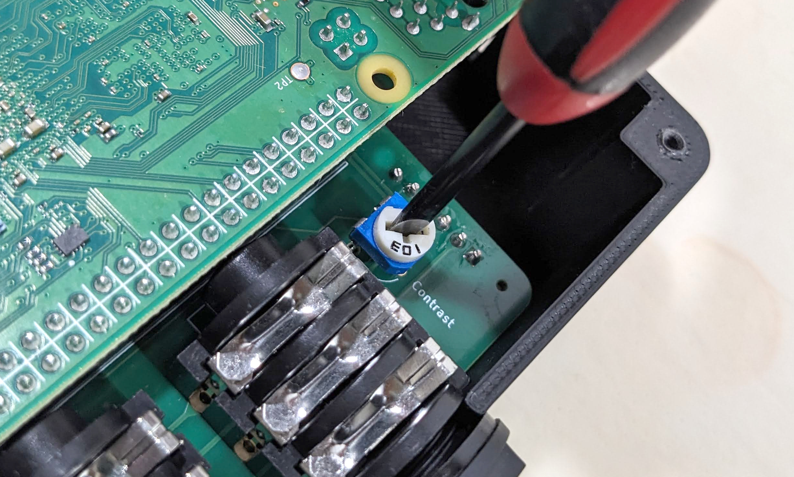
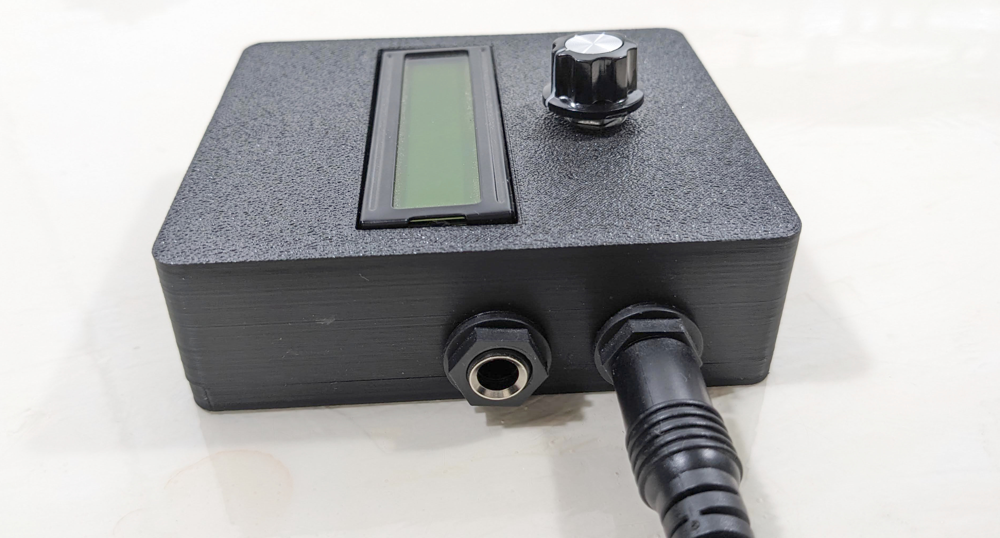
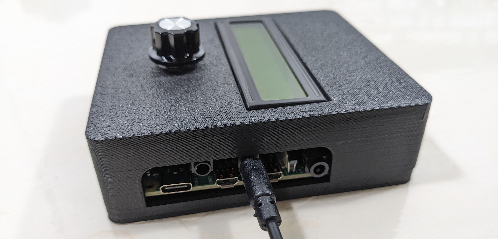

User Guide
==========

When powered on, the SquishBox starts a launcher that allows you to run
applications, browse tools, or modify system settings.

Navigation is designed to be simple and usable without a keyboard or display
larger than the built-in LCD.

Basic Controls
--------------

The primary control is the pushbutton rotary encoder.

* Turn the encoder to move through menus or adjust values
* Tap the encoder to confirm a selection
* Press and hold the encoder to cancel, go back, or exit the current screen

Most built-in applications follow this same control scheme.

Text Entry
^^^^^^^^^^

The SquishBox includes an on-screen text entry mode for naming files,
editing settings, and entering text without a keyboard.

Pressing the encoder toggles between two cursor modes:

* **Blinking block cursor** — Move the cursor position by turning the encoder
* **Blinking underline cursor** — Change the current character by turning the encoder

This allows text to be entered entirely from the front panel.

If a USB or wireless keyboard is connected to the Raspberry Pi, keyboard input
is also accepted anywhere text entry is available.

Safe Shutdown
^^^^^^^^^^^^^

To safely power down the system before disconnecting power, choose
**Shutdown** from the **Exit** menu.

This helps prevent filesystem corruption or SD card damage.

Hardware Controls and Connections
---------------------------------

Display Contrast Adjustment
^^^^^^^^^^^^^^^^^^^^^^^^^^^

The LCD contrast trimmer is accessible with the Raspberry Pi installed and the
rear cover removed.

Use a small screwdriver to adjust the trimmer for the best display clarity.

Contrast is controlled by both:

* The hardware trimmer potentiometer
* Software contrast settings

For best results, install the software first, then adjust the trimmer so the
software setting has a useful adjustment range.

   Adjustment of hardware contrast

Audio Outputs
^^^^^^^^^^^^^

The SquishBox provides two 1/4" audio output jacks.

Physical orientation:

* **Rear jack** = Left / Headphone output
* **Front jack** = Right / Mono output

(When viewed face-on, these appear on the left and right sides respectively.)

Behavior:

* If only the **Right / Mono** jack is connected, left and right channels are
  summed to mono on that output.
* If only the **Left / Headphone** jack is connected, stereo audio is routed to
  the tip and sleeve of a TRS connector for headphone use.

The PCB silkscreen also labels both jacks.

   
   Audio ports in mono connection mode

MIDI TRS Ports
^^^^^^^^^^^^^^

The SquishBox includes MIDI input and output on 3.5 mm TRS minijacks.

Physical orientation:

* **Front jack** = MIDI Out
* **Rear jack** = MIDI In

(When viewed from the front, these appear on the left and right sides respectively.)

The PCB silkscreen also identifies each port.

Headers with jumper blocks allow the MIDI jacks to be configured for either
TRS MIDI wiring standard:

* **Type A** = horizontal jumper position ( = )
* **Type B** = vertical jumper position ( ‖ )

Set both jumpers to match the equipment you are connecting.

   
   Connection to MIDI IN minijack

Included Apps
-------------

The included applications serve two purposes:

* Fully supported tools and audio programs for daily use
* Reference examples for developers using the SquishBox Python API

Bug reports and feature requests can be submitted through the project GitHub
issue tracker.

Utilities
^^^^^^^^^

``launcher.py``
   Main launcher used to start applications and access system settings.

``sbedit.py``
   Lightweight text editor that supports both encoder input and keyboards.

``glyphedit.py``
   Utility for creating and editing custom LCD glyph characters.

``sbcommander.py``
   File manager for copying, moving, renaming, deleting files, and running
   shell commands.

Sound Programs
^^^^^^^^^^^^^^

``fpatcherbox.py``
   Flexible synth and sound module built around the
   `FluidSynth <https://www.fluidsynth.org/>`__ engine using the
   `FluidPatcher <https://geekfunklabs.github.io/fluidpatcher/>`__ Python package.

``amsynthbox.py``
   Front-end wrapper for the amsynth analog-modeling synthesizer.

``trackbox.py``
   Playlist-based music player with live track reordering and quick cuts.
